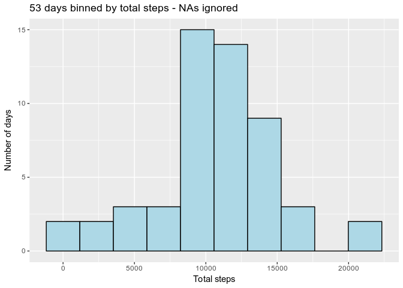
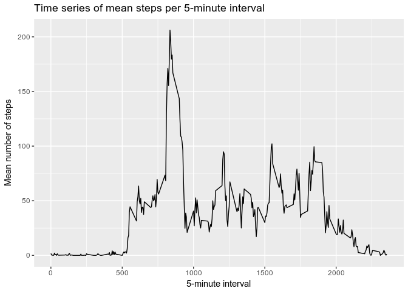
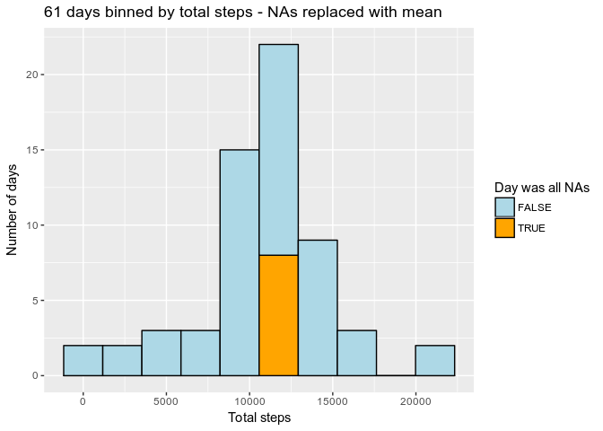
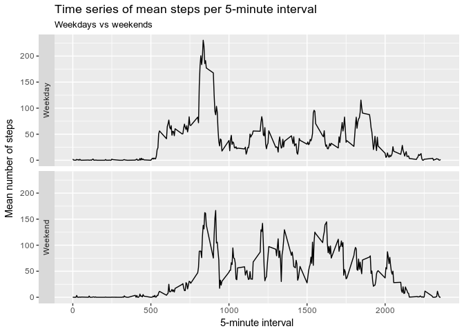

# Reproducible Research: Peer Assessment 1
Daniel Medina Stacey  
5 September 2017  


## Loading and preprocessing the data

Preprocessing is carried out in three steps:

1. Check for `activity.csv` file, otherwise unzip `activity.zip`

2. Specify the column classes, particularly to ensure the `date` column is 
treated as a `Date` object rather than as a factor.

3. Load the data into the `activity` data frame.


```r
if(!file.exists("activity.csv")){
    
    if(!file.exists("activity.zip")){
        stop("Need 'activity' .zip or .csv file.")
    }
    
    else{
        unzip(zipfile = "activity.zip")
    }
}
column_classes <- c("integer", "Date", "integer") 
activity <- read.csv(file = "activity.csv", colClasses = column_classes )
```


## What is the mean total number of steps taken per day?

The first step is to sum the number of steps taken per day (i.e. date), taking
no special action on NAs. We then calculate the mean and median number of steps
per day.


```r
steps_per_date <- aggregate(steps ~ date,
                            data = activity,
                            FUN = sum)
names(steps_per_date) <- c("Date","total_steps")

mean_steps <- mean(steps_per_date$total_steps)
median_steps <- median(steps_per_date$total_steps)

num_days <- nrow(steps_per_date)
```

The **mean** number of steps per day is 10766.19. The 
**median** number of steps per day is 10765. The number of days used 
in the calculation is 53 rather than the complete 
61 days in the dataset, as days where all steps 
are NA are ignored by `aggregate()`.

We plot a histogram of the total steps per day. Due to the number of days to be 
plotted, the number of bins is set to 10 rather than the default 30.


```r
library(ggplot2)

title <- paste(num_days,"days binned by total steps - NAs ignored")
histogram <- ggplot(steps_per_date) +
             aes(x=total_steps) +
             geom_histogram(bins=10,colour="black",fill="lightblue") +
             ggtitle(title) +
             xlab("Total steps")+
             ylab("Number of days")
print(histogram)
```

<!-- -->

## What is the average daily activity pattern?

We first generate a data frame of the mean number of steps per interval in a
similar way as earlier. We also determine the 5-minute interval which, on 
average, contains the maximum number of steps.


```r
steps_per_interval <- aggregate(steps ~ interval,
                                data = activity,
                                FUN = mean)
names(steps_per_interval) <- c("Interval","mean_steps")

max_steps <- max(steps_per_interval$mean_steps)
index_max <- which.max(steps_per_interval$mean_steps)

interval_max <- steps_per_interval$Interval[index_max]
```

The **5-minute interval with the highest average number of steps** is the 
104th interval, which corresponds to minute 835. The 
average number of steps in this interval is 206.17.

Now we plot the timeseries.


```r
timeseries <- ggplot(steps_per_interval) + 
              aes(x=Interval,y=mean_steps) + 
              geom_line() +
              ggtitle("Time series of mean steps per 5-minute interval") +
              xlab("5-minute interval") +
              ylab("Mean number of steps")
print(timeseries)
```

<!-- -->


## Imputing missing values

We calculate and report the number of missing values in the dataset.

```r
steps_NA <- is.na(activity$steps)
count_steps_NA = sum(steps_NA)
```

The **number of missing values** in the dataset is 2304. 

We will fill these values in with the mean number for each given interval and 
assign the result to a new dataset. We will also label NA intervals so as to 
keep track of days where all intervals were NAs.


```r
mean_of_interval <- function(Interval){
    
               mean(activity$steps[activity$interval==Interval], na.rm=TRUE)
    }

means_NA_intervals <- sapply(X = activity$interval[steps_NA], 
                                 FUN = mean_of_interval)
activity2 <- activity
activity2$steps[steps_NA] <- means_NA_intervals
activity2$was_NA <- steps_NA
```

We sum the number of steps taken per day as before.


```r
steps_per_date2 <- aggregate(steps ~ date,
                             data = activity2,
                             FUN=sum)
names(steps_per_date2) <- c("Date","total_steps")
steps_per_date2$was_NA <- aggregate(was_NA ~ date,
                             data=activity2,
                             FUN=all)$was_NA

mean_steps2 <- mean(steps_per_date2$total_steps)
median_steps2 <- median(steps_per_date2$total_steps)
```
The **mean of the steps in the new dataset** with NAs artificially replaced with
the mean for their given interval is 10766.19, unchanged 
from before. 
However, **the median is now** also 10766.19 rather 
than the previous 10765. This is unsurprising as every day that was 
previously NA has been filled in with the mean, reinforcing its central tendency
and establishing it as the median value of the set.

```r
num_days2 <- nrow(steps_per_date2)
title2 <- paste(num_days2,"days binned by total steps - NAs replaced with mean")
histogram2 <- ggplot(steps_per_date2) +
             aes(x=total_steps, fill=was_NA) +
             scale_fill_manual(
                 values=c("lightblue", "orange"), 
                 name="Day was all NAs")+
             geom_histogram(bins=10, colour="black") +
             ggtitle(title2) +
             xlab("Total steps")+
             ylab("Number of days")
print(histogram2)
```

<!-- -->
The artificial insertion of mean values in place of NAs has had a noticeable
impact on the histogram, as the mean is now overrepresented in the set and 
"pushes" up the central histogram bar. In other words: all NA days are now
average days.

## Are there differences in activity patterns between weekdays and weekends?

We now search for patterns in activity by weekday using the dataset with the
filled-in values as suggested by the assignment -- though this is likely to bias
the estimates. First we determine the weekday of each date and assign it as 
either a weekday or a weekend day:

```r
activity2$weekday <- weekdays(activity2$date, abbreviate = TRUE)
day_type <- c("Mon"="Weekday",
              "Tue"="Weekday",
              "Wed"="Weekday",
              "Thu"="Weekday",
              "Fri"="Weekday",
              "Sat"="Weekend",
              "Sun"="Weekend")

activity2$type <- day_type[activity2[["weekday"]]]

steps_per_interval_W <- aggregate(steps ~ interval * type,
                                  data = activity2,
                                  FUN = mean)
```
And now we plot the data:

```r
timeseries_W <- ggplot(steps_per_interval_W) + 
              aes(x=interval,y=steps) + 
              geom_line() +
              ggtitle("Time series of mean steps per 5-minute interval") +
              labs(subtitle="Weekdays vs weekends")+
              xlab("5-minute interval") +
              ylab("Mean number of steps") +
              facet_grid(facets=type~.,switch = "y")
print(timeseries_W)
```

<!-- -->

The two most obvious differences between weekdays and weekends are:

* Activity starts earlier on weekdays, maybe corresponding to an earlier
rising time.

* Activity is more evenly distributed along the day in weekends, maybe due to
greater leisure time as opposed to spending time at a mostly sedentary job.
